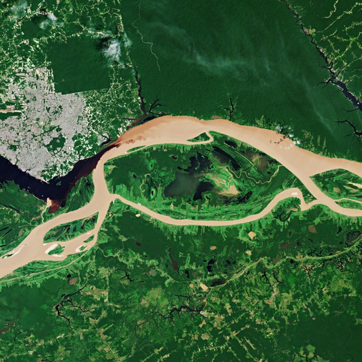
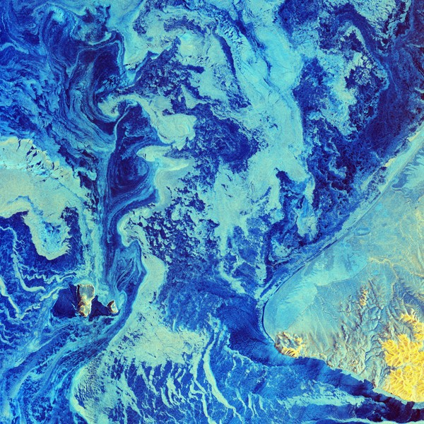
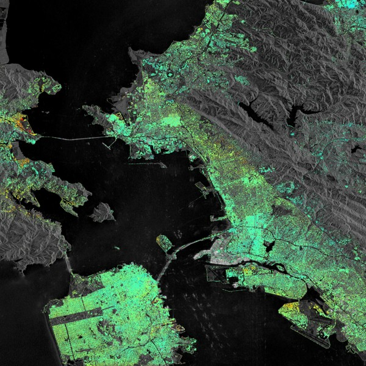
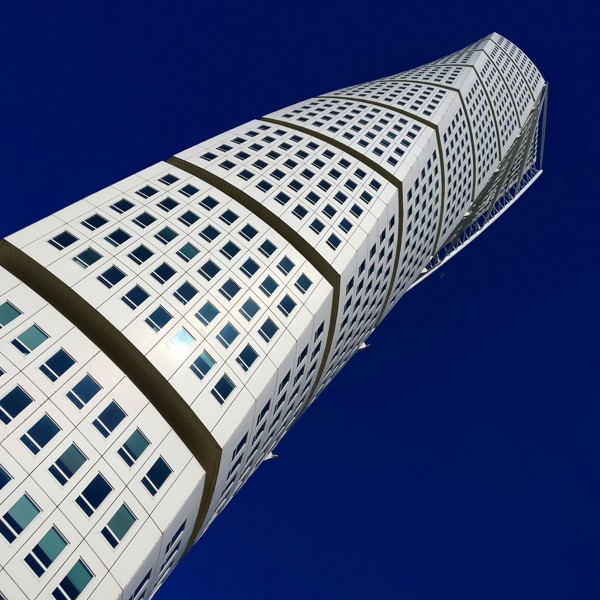
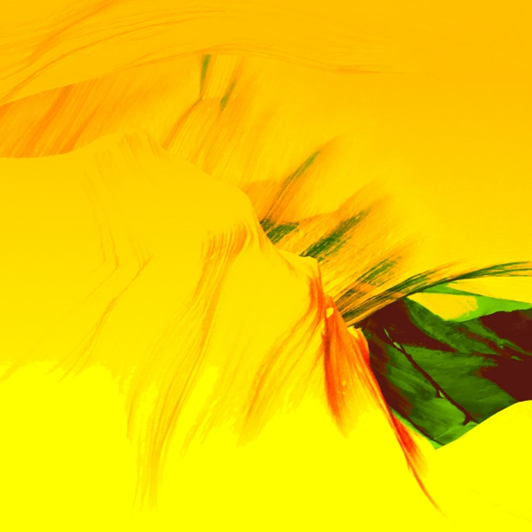
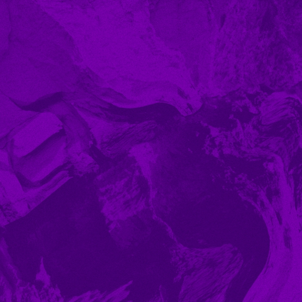

This repository is a collection of unofficial wallpapers for AsteroidOS.
Feel free to pull request your work here.

### Install selected or all wallpaper via scripted SCP/SSH ###

- Open a terminal and clone this unofficial-asteroid-wallpapers repo to a new subfolder from your current location.\
`git clone https://github.com/JRTberlin/unofficial-asteroid-wallpapers`
- Cd into unofficial-asteroid-wallpapers folder.\
`cd unofficial-asteroid-wallpapers/`
- Connect your AsteroidOS Watch, configured to Settings -> USB -> Developer Mode.
- Start `./deploy.sh` and select a single wallpaper with its given number or copy all available wallpapers at once with option 1.
- You may need to [restart the session or watch](https://asteroidos.org/wiki/useful-commands/#restart) if for example new fonts were installed along with the new wallpapers.

### List of Wallpapers ###

| Preview | Wallpaper Title | Creator | License |
|---|---|---|---|
|  | Meeting of waters | [Copernicus Sentinel data (2018), processed by ESA](https://www.esa.int/ESA_Multimedia/Images/2019/09/Meeting_of_waters) | [CC BY-SA 3.0 IGO](https://creativecommons.org/licenses/by-sa/3.0/igo/) |
|  | Bering in dire straits | [Copernicus Sentinel data (2019), processed by ESA](https://www.esa.int/ESA_Multimedia/Images/2019/03/Bering_in_dire_straits) | [CC BY-SA 3.0 IGO](https://creativecommons.org/licenses/by-sa/3.0/igo/) |
|  | based on "Bay Area displacement" | [Copernicus Sentinel data (2015–16) / ESA SEOM INSARAP study / PPO.labs / Norut / NGU](http://www.esa.int/Applications/Observing_the_Earth/Copernicus/Sentinel-1/Satellites_confirm_sinking_of_San_Francisco_tower) | [CC BY-SA 3.0 IGO](https://creativecommons.org/licenses/by-sa/3.0/igo/) |
|  | Turning Torso | [jrt](https://jrtberlin.de) | [CC BY-SA 3.0 IGO](https://creativecommons.org/licenses/by-sa/3.0/igo/) |
|  | Yellow Asteroid Cannyon | [jrt](https://jrtberlin.de) | [CC BY-SA 3.0 IGO](https://creativecommons.org/licenses/by-sa/3.0/igo/) |
|  | Fluid Lilac | [jrt](https://jrtberlin.de) | [CC BY-SA 3.0 IGO](https://creativecommons.org/licenses/by-sa/3.0/igo/) |